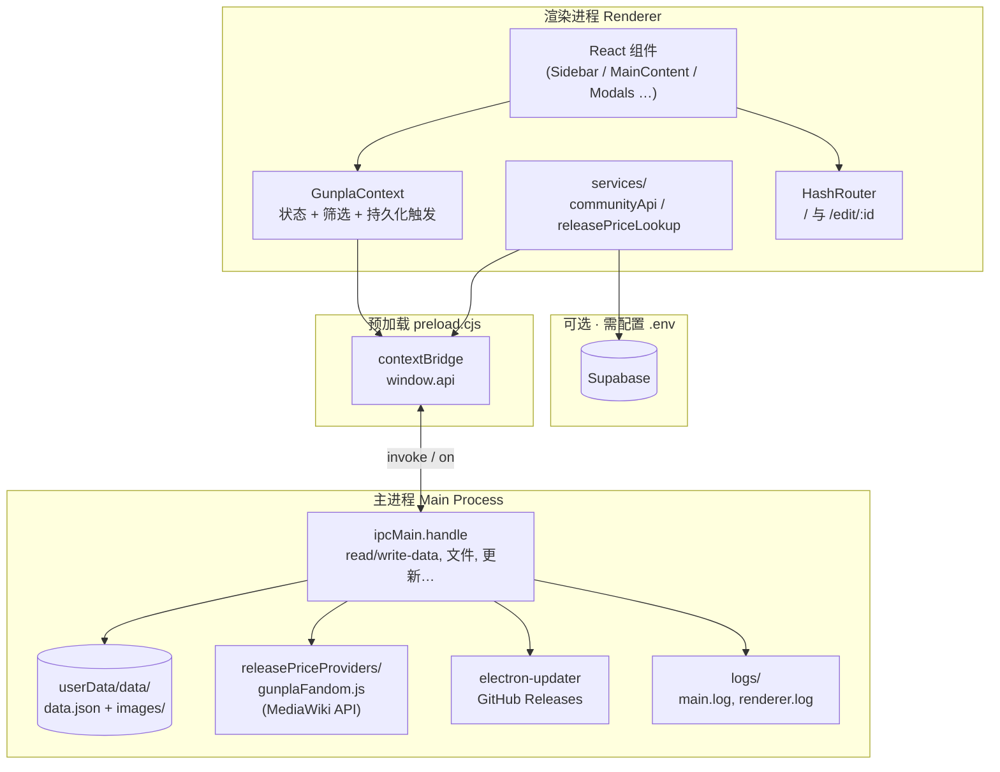
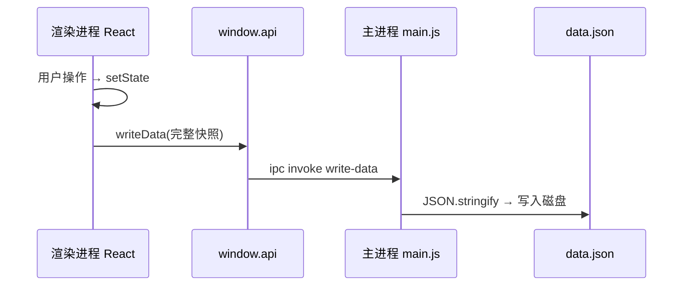
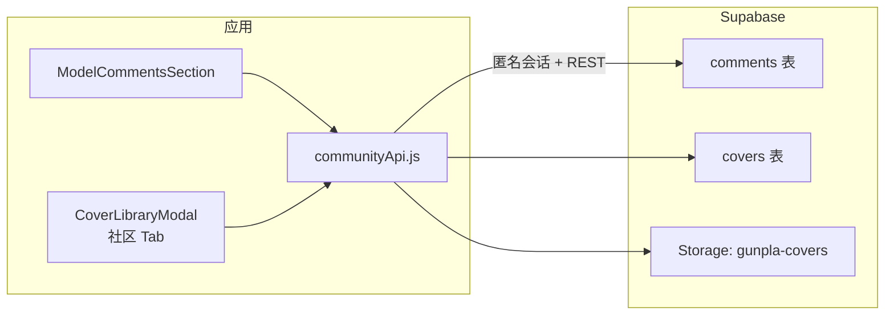

# Gunpla Manager

## Mobile Web

- 移动端首版按 `Vercel + H5/PWA` 发布
- 用户通过公开网址访问，不需要安装原生 App
- 桌面端负责“导出到移动端”，移动端负责导入 JSON 数据包
- 具体部署方式见 [MOBILE_WEB_DEPLOYMENT.md](/C:/jlzxm/wj/MOBILE_WEB_DEPLOYMENT.md)

本地优先的 Gunpla（高达模型）收藏管理桌面应用：录入与看图、树状筛选与统计、Excel / JSON 数据交换；可选联网查询发售价与盒绘、可选 Supabase 云端评论与社区封面。

---

## 技术栈

| 层级 | 技术 |
| --- | --- |
| 前端 | **React 19**、**Vite 8**、**Tailwind CSS 3**、**react-router-dom**（**HashRouter**） |
| 桌面 | **Electron 37**、主进程 **ESM**（`electron/main.js`）、**preload**（`electron/preload.cjs` + `contextIsolation`） |
| 数据 | 本地 **`data.json`** + **`images/`**；可选 **Supabase**（评论、公开封面、Storage） |
| 构建与发布 | **electron-builder**（Windows **NSIS**）、**electron-updater**（**GitHub Releases**） |
| 工具库 | **xlsx**（Excel）、**pdfjs-dist**（PDF 预览）、**@supabase/supabase-js** |

---

## 架构总览

### 进程与模块（Mermaid）



### 典型数据流：保存



### 可选云端（Supabase）



说明：云端能力**不写入**本地 `data.json` 中的模型记录；评论以 `model_id`（本地模型 id 字符串）关联。

---

## 目录结构（关键路径）

| 路径 | 职责 |
| --- | --- |
| `src/App.jsx` | 路由：`/` 主布局、`/edit/:id` 编辑页；全局弹窗挂载点 |
| `src/main.jsx` | 入口；**HashRouter** |
| `src/context/GunplaContext.jsx` | 核心业务状态、筛选、导入导出、与 `window.api` 读写 |
| `src/utils/configTree.js` | Grade/系列/标签等**树状配置**的增删改、扁平化、选项构建 |
| `src/utils/excelImport.js` / `excelTemplate.js` | Excel 解析与模板 |
| `src/utils/localStorage.js` | 浏览器侧 JSON 文件读写的辅助（导入备份） |
| `src/services/communityApi.js` | Supabase：评论、社区封面列表、本机封面上传 |
| `src/services/releasePriceLookup.js` | 封装 `window.api.fetchGunpla*`（仅桌面端有效） |
| `src/hooks/useSupabaseSession.js` | Supabase 匿名会话初始化 |
| `src/supabaseClient.js` | Supabase 客户端与环境检测 |
| `electron/main.js` | 窗口、**全部 IPC**、`data.json`、图片、PDF、更新、Wiki 查询 |
| `electron/preload.cjs` | 暴露 **`window.api`**（与 `main.js` 通道名一一对应） |
| `electron/releasePriceProviders/gunplaFandom.js` | Gunpla Wiki（Fandom）API：页面解析、发售价、盒绘 URL |
| `supabase/schema.sql` | 表 **covers / comments**、RLS、Storage 桶 **gunpla-covers** |
| `src/data/changelog.js` | 用户可见更新日志（发版时与 `package.json` 版本同步） |

---

## 本地数据与持久化

### 磁盘位置（Electron）

| 路径（相对 `app.getPath('userData')`） | 内容 |
| --- | --- |
| `data/data.json` | 应用主存档（由渲染层 `writeData` 写入的完整对象） |
| `data/images/` | 用户上传/导入/Wiki 下载的图片 |
| `logs/` | `main.log`、`renderer.log`（渲染层通过 `logRenderer` 追加） |

首次启动时若不存在 `data.json`，主进程会写入一份与 `DEFAULT_DATA` 接近的默认 JSON（见 `electron/main.js`）。

### `writeData` 写入的典型字段（与 `GunplaContext` 中 `useEffect` 一致）

包含但不限于：`gunplaList`、`coverLibrary`、`categoryConfig`、`configTree`、`buildStatusConfig`、`filterState`、`uiState`、`theme`、`manualRootPath`。

### 用户「导出 JSON 备份」（`exportData`）与磁盘全量的差异

- 导出文件包含：`gunplaList`、`categoryConfig`、`configTree`、`buildStatusConfig`、`filterState`、`theme`、`manualRootPath`、`exportedAt`、`version`。
- **未包含**：`coverLibrary`、`uiState` 等（若需完整迁移封面库，应以实际业务为准考虑是否扩展导出或直接使用 `data.json` 备份）。
- **导入**（`importData`）：若 JSON 中存在 `coverLibrary`，会一并恢复。

### 无 `window.api` 时（纯浏览器跑 Vite）

- 不会写入 `data.json`；首屏可能以空数据或内存状态运行（见 `GunplaContext` 中 `readData` 分支）。
- 所有依赖 `window.api` 的能力均不可用或会提示（更新、PDF 扫描、Wiki 查询、本机封面上传等）。

---

## IPC：`window.api` 与主进程通道

渲染层通过 **`preload.cjs`** 访问 **`window.api`**（仅暴露白名单方法）。下表 **`IPC 通道`** 为 `ipcMain.handle` 第一个参数，与 `preload` 中 `invoke` 一致。

| `window.api` 方法 | IPC 通道 | 参数 | 返回值 / 行为摘要 |
| --- | --- | --- | --- |
| `readData` | `read-data` | — | 读取并解析 `data.json`，失败则回退默认结构 |
| `writeData` | `write-data` | `data: object` | 整体覆盖写入 `data.json` |
| `saveImage` | `save-image` | `fileBuffer: ArrayBuffer`, `fileName: string` | 写入 `images/` 下唯一文件名，返回 `file://` URL |
| `deleteImage` | `delete-image` | `imagePath: string` | 删除本地文件（支持 `file://`） |
| `readImageBuffer` | `read-image-buffer` | `fileUrl: string` | 仅允许读取 **`images/` 目录内**的 `file://` 图片 → base64，供上传社区 |
| `selectFolder` | `select-folder` | — | 打开目录选择对话框，取消返回 `''` |
| `importCoverFolder` | `import-cover-folder` | `folderPath: string` | 递归扫描图片 → 复制到 `images/`，返回 `{ ok, message, items[] }` |
| `listPdfFiles` | `list-pdf-files` | `folderPath`, `recursive?` | 列出 PDF，`{ ok, data[] }`，项含 `fileUrl`、`relativePath`、`folder1` |
| `logRenderer` | `log-renderer` | `level`, `message` | 追加到 `renderer.log` |
| `openLogsFolder` | `open-logs-folder` | — | 打开日志目录 |
| `getLogsPath` | `get-logs-path` | — | `{ logsDir, mainLogPath, rendererLogPath }` |
| `checkForUpdates` | `update-check` | — | 打包环境调用 `autoUpdater.checkForUpdates`；开发模式返回不可用 |
| `quitAndInstallUpdate` | `update-quit-and-install` | — | `quitAndInstall`；开发模式不可用 |
| `wipeAllData` | `wipe-user-data` | — | **仅打包**：删 `data`、日志、部分 Chromium 缓存目录后 `relaunch`；开发模式拒绝 |
| `fetchGunplaReleasePrice` | `fetch-gunpla-release-price` | `{ name?, modelCode?, grade? }` | Wiki 查询发售价（日元），结构见 `gunplaFandom.js` |
| `fetchGunplaCoverImage` | `fetch-gunpla-cover-image` | 同上 | 解析盒绘并 **下载到 images/**，返回 `file://` 等 |
| `onUpdateEvent` | （事件） | `handler(payload)` | 订阅 **`update-event`**，非 invoke；见下表 |

### `onUpdateEvent` 的 `payload.type`（与 `Header.jsx` 处理一致）

| `type` | 说明 |
| --- | --- |
| `checking-for-update` | 正在检查 |
| `update-available` | 有更新；`payload.info` 含版本信息等 |
| `update-not-available` | 已最新 |
| `download-progress` | `payload.progress`（如 `percent`） |
| `update-downloaded` | 下载完成，可 `quitAndInstallUpdate` |
| `error` | `payload.message` |

主进程在开发模式下会**禁用** `autoUpdater` 的常规日志行为；手动「检查更新」仍走 `update-check` handler。

---

## 联网查询（Wiki）

- **实现**：`electron/releasePriceProviders/gunplaFandom.js` → `https://gunpla.fandom.com/api.php`（MediaWiki）。
- **发售价**：解析维基正文中的价格信息；结果含 `sourceUrl` 等供 UI 提示。
- **盒绘**：解析信息框/图片 URL 后由主进程 `downloadWikiCoverToLibrary` 下载到本地 `images/`，再返回 `file://`。

---

## 可选云端：Supabase

| 项目 | 说明 |
| --- | --- |
| 环境变量 | `.env.example` → `VITE_SUPABASE_URL`、`VITE_SUPABASE_ANON_KEY` |
| 认证 | 需在 Supabase 控制台启用 **Anonymous** 登录 |
| 数据表 | `comments`（`model_id` 文本）、`covers`（元数据） |
| Storage | 公开桶 **`gunpla-covers`**，与 `communityApi.js` 中 `COMMUNITY_COVERS_BUCKET` 一致 |
| 初始化 | 执行 `supabase/schema.sql`（含 RLS 与 Storage 策略） |

---

## 功能清单（产品）

### 模型与展示

- 类型：**已拥有** / **愿望清单**；顶部 Tab + 筛选 `filterState.type`。
- 字段：名称、编号、Grade、系列、比例、标签、拼装状态、旧版拼装「状态」、价格与数量、购买信息、备注等。
- 图片：**封面**、**成品**、**盒照**；详情抽屉与 **`/edit/:id`** 编辑页。
- UI：搜索、卡片密度、Grade Logo（树配置上传 + 显示开关）、自定义主题背景。

### 筛选与配置

- 左侧 **树状筛选**（Grade / 拼装进度 / 系列 / 标签）；配置项在「类型管理」中维护，**树结构**与 `configTree.js` 同步；删除节点时可 **替换引用**。

### 统计

- 入手合计、粗略盈亏、按 Grade/系列/拼装状态/月份等分布。

### 数据交换

- **JSON**：导出 / 导入（见上文「导出与全量差异」）。
- **Excel**：`.xlsx` / `.xls` 导入；模板下载。

### 封面库与说明书

- 本机文件夹导入、封面资料库管理；社区 Tab（Supabase）。
- 说明书：指定目录，递归列出 PDF，`PdfPreview` 预览。

### 仅桌面端

- 本地持久化、图片与 PDF、Wiki 查价与拉封面、更新与日志、擦除用户数据。

---

## 开发与构建

```bash
npm install
npm run dev          # Vite 开发服务
npm run build        # 产出 dist/
npm run electron     # 启动 Electron（开发时常配合 localhost:5173，见 main.js）
npm run lint
npm run dist:win     # build + NSIS → release/
npm run test:supabase  # 需配置 .env
```

打包、GitHub Release 附件与版本流程见 **`PACKAGING.md`**。

---

## 版本与仓库

- **仓库**：`https://github.com/hhf20/gunpla-manager`（`package.json` → `repository`）。
- **版本号**：以 `package.json` 的 `version` 为准；发版时同步 `src/data/changelog.js`。

---

## 作者与反馈

本软件由作者独立开发与维护。若你在使用中有疑问、建议或想反馈问题，欢迎添加作者微信交流。

- **微信号**：`hhf_999`
